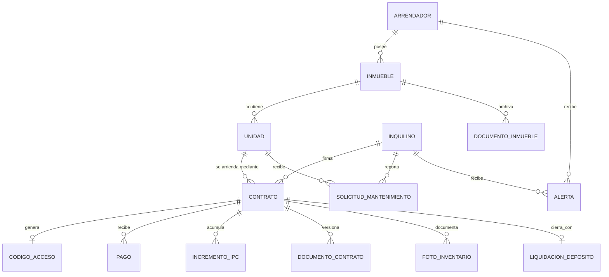
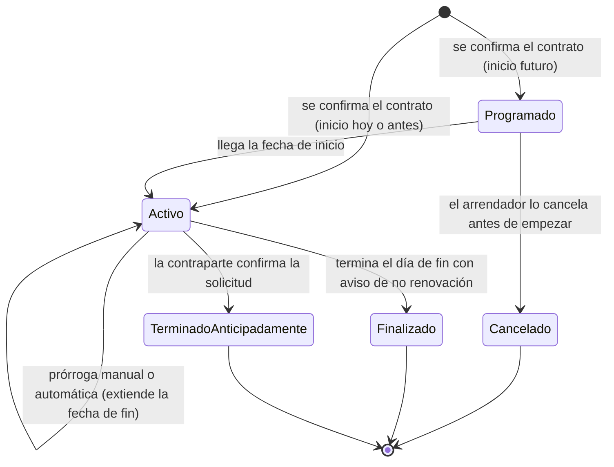
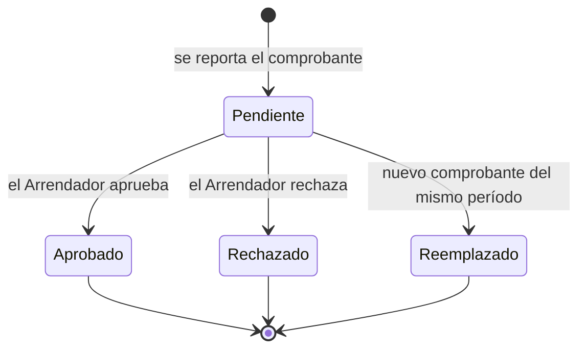

# RentCheck — Contexto de producto para la aplicación móvil

> **Versión del documento:** 2.16 — 2 de octubre de 2026. Es la especificación de producto vigente y la **fuente de verdad** de las reglas de negocio.
> **Propósito:** describir, en lenguaje de negocio, la lógica, los datos, las reglas, los estados, los permisos y los requisitos de seguridad y cumplimiento de RentCheck, para que un equipo (personas o una IA) pueda construir la **aplicación móvil nativa** sin ambigüedades.
> **Fuera de alcance:** diseño visual y elección de tecnologías concretas (eso está en `RentCheck_Plan_Tecnico_App_Movil.md`).

**Cambios de la versión 2.16 frente a la 2.15** (decisiones del 02/10/2026 tras probar E9; detalle y orden en `RentCheck_Plan_Rediseno_UX.md`):
- **Entrar con Google** para ambos roles (3.1, 3.2; D-11).
- **Pagos verificables en dos fases** (5.10; D-12): A) llave Bre-B del arrendador y referencia única por período; B) pasarela en modo pruebas para la demostración.
- **Retención de alertas** y **mora como máximo semanal** (5.16, 11; D-13).
- **Panel del arrendador** reorientado a cuatro preguntas (9; D-14); el del inquilino sigue el diseño original (10).

**Cambios de la versión 2.15 frente a la 2.14** (entrega B0.6-A2, Panel del arrendador, B-58): la **mora incluye los períodos Parciales** (un período vencido con algo aprobado pero menos que el canon sigue debiendo; el código y las alertas ya lo hacían así), en la regla 21 y en 7.2; y la fila **Panel** de la sección 9 pasa a tener definiciones operativas (ver la nota debajo de la tabla de 9).

**Cambios de la versión 2.14 frente a la 2.13** (entrega E7-A, B-64, solo precisión de 5.10):
- **Monto reportado y pago parcial (5.10):** el servidor no compara el monto reportado con el canon ni rechaza un monto distinto. El que queda **Parcial** es el **período**: si, una vez aprobados los pagos, lo aprobado es menor que el canon vigente del período. La aplicación móvil avisa al Inquilino antes de enviar un monto menor al saldo del período ("quedará como pago parcial") o mayor ("no cubre otros períodos"), sin impedir el envío. Un monto mayor no se reparte entre períodos: cada período se reporta por separado. Si esto debe cambiar (por ejemplo, repartir el excedente), es una decisión de producto aparte.

**Cambios de la versión 2.13 frente a la 2.12** (entrega B0.6-A1, B-59):
- **Motivo del rechazo de un pago (5.10 y 7.3):** al rechazar un pago el Arrendador puede indicar un **motivo de una lista fija** (el monto no coincide, no se ve el pago, el comprobante es ilegible u otro) y un **mensaje opcional de hasta 200 caracteres**; el Inquilino los ve en su pago rechazado. Con el motivo "otro" el mensaje es obligatorio, y un mensaje exige motivo. El servidor acepta el rechazo sin motivo (compatibilidad con la web provisional); la aplicación móvil lo pide siempre. Los rechazos anteriores a este cambio no tienen motivo. La alerta al Inquilino con el motivo llega con las alertas del Inquilino (B-18).

**Cambios de la versión 2.12 frente a la 2.11** (entrega B0.4-D1, regla 34 y decisiones D-9 y D-10):
- **Verificación de correo (regla 34):** con un proveedor de correo configurado, una cuenta nueva (arrendador o inquilino) no inicia sesión hasta verificar su correo con un código de 6 dígitos (10 minutos de vigencia, 5 intentos por código, 60 segundos entre reenvíos y máximo 5 envíos por hora). **Sin proveedor configurado el sistema funciona como antes** y no exige verificación; así es hoy en producción.
- **D-9 precisada con datos de hoy (30/09/2026):** ningún plan gratuito permite enviar a usuarios reales sin un dominio propio verificado (Resend solo envía al correo del dueño de la cuenta sin dominio; Brevo reemplaza remitentes de Gmail y los manda a spam). El dominio debe permitir agregar registros DNS. Mientras no exista, el envío queda apagado (D-10, opción C).
- La recuperación de contraseña sigue pendiente (entrega B0.4-D2) y depende del mismo proveedor.

**Cambios de la versión 2.11 frente a la 2.10** (entrega B0.4-C, precisión de 5.8, sin reglas nuevas):
- Corregir un contrato sin vincular (términos o datos del inquilino) genera una **nueva versión del Contrato original**; las anteriores se conservan. Si se corrige la cédula, el contrato pasa a la identidad correcta y el código se regenera.

**Cambios de la versión 2.10 frente a la 2.9** (entrega B0.4-A3, precisiones de 3.3 y del modelo de datos):
- **Intentos fallidos por origen, no por código:** quien adivina no tiene un código real contra el cual contar. Tras 5 intentos fallidos seguidos desde el mismo origen (o desde la misma cuenta, al agregar un contrato), quedan bloqueados 15 minutos; un intento correcto reinicia la cuenta. El código vencido, ajeno, ya usado o cancelado responde igual que uno inexistente.
- La forma escrita del código no importa: se aceptan minúsculas, espacios y ausencia de guiones.
- Ya rigen las reglas 24 a 26 (correo único entre roles, en minúsculas y con mensaje genérico) y no existe un modo de preguntar si una cédula está registrada.

**Cambios de la versión 2.9 frente a la 2.8** (entrega B0.4-A2, sin reglas nuevas: precisiones de 3.2, 3.3 y 5.6):
- Un contrato **sin vincular** no existe para el Inquilino (no aparece en ninguna pantalla ni permite reportar pagos o crear solicitudes). Vincular ocurre al crear la cuenta con el código o con "Agregar contrato con código".
- Un código que no se puede usar (inexistente, de otra persona, ya usado o de un contrato Cancelado) recibe siempre la misma respuesta, para no revelar cuál fue la causa. Solo puede vincular la cuenta a nombre de la cual está el contrato.
- Al vincularse el contrato, el Arrendador recibe una alerta. El correo del Inquilino solo se muestra al Arrendador cuando el contrato está vinculado.
- Al activar esta función, los contratos de personas que ya tenían cuenta quedaron vinculados automáticamente.

**Cambios de la versión 2.8 frente a la 2.7** (entrega B0.4-A1 y una propuesta de producto):
- **Datos del inquilino en el contrato** (5.6): el nombre y el teléfono no pueden estar vacíos y el documento se guarda normalizado. Todo lo que ve el Arrendador sale de esa copia.
- **Nueva decisión D-10** (sección 16): verificar el correo con un código enviado a la cuenta al registrarse. Es una propuesta de Jesús. Implementada en B0.4-D1 con el proveedor apagado hasta tener un dominio verificado (ver regla 34 y D-9).

**Cambios de la versión 2.7 frente a la 2.6** (entrega B0.3-A3-4, cierre del bloque 0.3):
- **Aviso de no renovación** (regla 16): lo pueden dar el Arrendador y el Inquilino mientras el contrato esté Activo y antes del último día; quien lo dio puede cancelarlo mientras no venza; aplica siempre a la fecha de fin vigente (también tras una prórroga automática). Queda registrado con quién, cuándo y motivo.
- **Prórroga automática** (regla 16): sin aviso, se aplica al día siguiente de la fecha de fin, por el término inicial, con su otrosí. **Excepción:** si la Unidad ya tiene un contrato Programado posterior, el contrato que llega a su fecha de fin sin aviso pasa a Finalizado (no se prorroga, porque se traslaparía con el siguiente). Si el sistema estuvo sin correr varios días, aplica las prórrogas necesarias hasta que la fecha de fin no esté vencida (máximo 12 por corrida).
- Los contratos que ya estaban Finalizados antes de esta versión no se prorrogan (la regla rige solo hacia adelante).

**Cambios de la versión 2.6 frente a la 2.5** (entrega B0.3-A3-3):
- **Ciclo de vida del contrato** (7.1): nuevos estados **Programado** (fecha de inicio futura; no cuenta como Activo ni bloquea la unidad) y **Cancelado** (un contrato Programado anulado por el arrendador; se conserva, no se borra).
- **Sin traslape** (5.1): los contratos Activo y Programado de una misma unidad no pueden compartir ningún día; el siguiente empieza después del último día del anterior (fecha de fin, o la fecha efectiva si hay terminación anticipada confirmada).

**Cambios de la versión 2.5 frente a la 2.4** (entrega B0.3-A3-2):
- **Terminación anticipada** (regla 17): la fecha efectiva es obligatoria, de hoy en adelante y no posterior a la fecha de fin; el contrato sigue Activo y exigible hasta esa fecha; el estado de cuenta no genera períodos posteriores a ella; ninguna parte confirma su propia solicitud.
- **Cumplimiento legal** (sección 13): se verificó que el mutuo acuerdo es el artículo 21 de la Ley 820 (sin preaviso, causal ni indemnización) y se fija la advertencia obligatoria en la app. La sección deja de depender de un abogado (ver la nota de esa sección).

**Cambios de la versión 2.4 frente a la 2.3** (entrega B0.3-A3-1):
- **Plantilla legal y unidad** (5.6): la plantilla del contrato debe corresponder a la unidad. Parqueadero → plantilla Parqueadero; en otro caso, uso Residencial → Vivienda Urbana y uso Comercial → Local Comercial. Cualquier otra combinación se rechaza al crear el contrato.

**Cambios de la versión 2.3 frente a la 2.2** (resultado de construir el incremento y la prórroga, entrega B0.3-A2):
- **Incremento** (regla 14, 5.7): aclara desde cuándo rige el canon nuevo y que el canon del contrato es siempre el vigente hoy; el canon de un período pasado sale del historial.
- **Prórroga** (regla 15): cada prórroga queda registrada con su historial.

**Cambios de la versión 2.2 frente a la 2.1** (resultado de construir las reglas de creación, entrega B0.3-A1):
- **Unidad principal** (5.3): ya no se crea con valores de relleno; el arrendador elige su uso (Residencial por defecto) y queda "por completar" hasta que llene los datos residenciales.
- **Estrato** (5.3): obligatorio solo si el inmueble tiene alguna Unidad Residencial; no se puede quitar mientras la tenga.
- **Campos residenciales de la Unidad** (5.4): mínimos definidos (área de 1 m² o más, ocupantes máximos de 1 o más) y exigidos completos al pasar una unidad a Residencial.

**Cambios de la versión 2.1 frente a la 2.0** (resultado de auditar el código real del backend y la Ley 820 de 2003):
- **Período de cobro** como concepto explícito (5.15): cada pago cubre un mes concreto. La mora se calcula por período, no por "último pago reportado".
- **Depósito en dinero prohibido en vivienda urbana** (Ley 820, art. 16). Solo aplica a local y parqueadero. La liquidación de depósito queda limitada a esos dos tipos.
- **Incremento de IPC y prórroga del contrato separados**: el incremento se aplica como máximo una vez cada 12 meses y, en vivienda, con tope del IPC del año anterior.
- **Vencimiento vs. prórroga automática** en vivienda (Ley 820, art. 6): nuevo "aviso de no renovación". Queda como decisión D-1.
- **Vinculación de contratos** para inquilinos que ya tienen cuenta, y **copia de los datos del inquilino dentro del contrato**.
- **Versiones del PDF**: el contrato original nunca se sobrescribe; cada cambio genera un otrosí.
- **Terminación anticipada**: confirma la contraparte de quien la solicita. Queda como decisión D-2.
- **Hora oficial `America/Bogota`** para todo cálculo de fechas.
- Decisiones pendientes numeradas (D-1…D-9), con una recomendación en cada una.

---

## 0. Resumen ejecutivo

RentCheck es una plataforma de gestión de arriendos para el **mercado colombiano**, dirigida a arrendadores que administran uno o varios inmuebles (residenciales, comerciales o parqueaderos) y necesitan un solo lugar para controlar propiedades, inquilinos, contratos, pagos, mantenimiento y alertas de vencimiento o mora.

**Eslogan:** "Gestión de arriendos, sin complicaciones".

Hay dos roles: **Arrendador** (administra su portafolio) e **Inquilino** (gestiona su propio arriendo). Un Arrendador puede tener muchos Inmuebles, Unidades, Inquilinos y Contratos. Un Inquilino solo ve y actúa sobre lo suyo, y puede tener contratos con varios Arrendadores bajo una sola cuenta.

Ya existe una API construida y desplegada que implementa gran parte de esta lógica. La app móvil es un **nuevo cliente** de esa API. Antes de construirla se corrigen en la API las diferencias con este documento (lista completa en el plan técnico, sección 3). Todavía no hay usuarios reales, lo que permite corregir sin migrar datos de clientes.

---

## 1. Plataforma y plan por fases

| Fase | Objetivo |
|:-:|---|
| **1** | Estabilizar la lógica de negocio: este documento más la Fase 0 de correcciones del backend. |
| **2 (actual)** | Construir la **aplicación móvil** sobre esa lógica. Android primero; iOS cuando se decida publicar allí. |
| **3** | Reconstruir la versión web como otro cliente de la misma API. |

Implicaciones:
- **La lógica de negocio no depende del cliente.** Toda regla y todo permiso se valida en el servidor.
- **Pensar en móvil sin atar la lógica al móvil.** Cámara, notificaciones push y conexión inestable se aprovechan, pero ningún flujo depende solo de ellas.
- **La web de la fase 3 opera con las mismas reglas.**

---

## 2. Fundamentos ya construidos (referencia para integración)

- API REST con autenticación por token, en dos variantes según el rol. Un token de un rol nunca sirve para operar como el otro.
- Archivos privados: el cliente recibe **enlaces temporales** (expiran en 1 hora) y nunca los guarda como permanentes.
- Límite general de peticiones y uno más estricto en inicio de sesión.
- Ningún registro con valor financiero o contractual se elimina físicamente; solo cambia de estado.
- Alertas automáticas diarias (vencimientos, mora, mantenimiento sin atender, revisión de IPC).
- **Todavía no existen:** recuperación de contraseña (B0.4-D2), doble factor, un proveedor de correo real en producción (la verificación de correo ya está construida pero apagada), canal de notificación fuera de la app (push o correo), auditoría de acciones sensibles, alertas para el inquilino, renovación de sesión.

---

## 3. Autenticación y acceso

### 3.1 Arrendador

- Registro abierto: nombre, correo (único; es su identificador de acceso), teléfono y contraseña (mínimo 8 caracteres, con al menos una letra y un número).
- Inicio de sesión con correo y contraseña, **o con Google** (D-11): registrarse o entrar con una cuenta de Google con correo verificado; ese correo es el identificador. El teléfono y la cédula se completan después en "Mi perfil". El correo no se puede editar después del registro.
- La cédula **no** se pide al registrarse; se completa en "Mi perfil". **Regla:** no se puede confirmar un Contrato si el Arrendador no tiene cédula registrada.
- Foto de cédula o NIT: opcional, subida como archivo.

### 3.2 Inquilino

- No se registra libremente. Recibe un **medio de activación** que se genera automáticamente **al confirmar** la creación de su Contrato.
- **Medio de activación:** un código corto con formato `RC-XXXX-XXXX` (8 caracteres, sin caracteres que se confundan como 0/O o 1/I) **y** un enlace o QR equivalente que abre la app en la pantalla de activación con el código ya escrito.
- **Si la persona aún no tiene cuenta:** con el código crea su cuenta (correo y contraseña) y en el mismo paso queda **vinculada** a ese contrato. La foto de cédula es opcional y se sube después, desde su perfil.
- **Si la persona ya tiene cuenta** (por un contrato anterior o con otro arrendador): inicia sesión y usa "Agregar contrato con código". El contrato nuevo aparece en su portal solo después de ese paso.
- **Con Google (D-11):** tras validar el código de activación, la persona puede crear su cuenta con Google en vez de correo y contraseña; la vinculación al contrato es la misma.
- Ingresos posteriores: correo y contraseña, o Google si así creó o vinculó su cuenta.
- Tras terminar un contrato, el Inquilino conserva el acceso de solo lectura a ese contrato. Las acciones operativas quedan bloqueadas.
- **Identidad única en toda la plataforma:** la persona se identifica por su número de documento (normalizado: sin puntos, espacios ni guiones) y su cuenta por un correo único global (comparado sin distinguir mayúsculas ni espacios sobrantes).
- **Riesgo aceptado para la primera versión:** el sistema no verifica que quien activa sea la persona cuyo nombre y cédula registró el Arrendador.

### 3.3 Gestión del medio de activación

- Se genera al confirmar el Contrato. El Arrendador puede copiarlo, compartirlo (con el menú nativo de compartir, sin pedir permiso de contactos) o **regenerarlo**.
- Regenerar invalida el anterior de inmediato. No se guarda historial de códigos.
- Expira a los **7 días** si no se usa (el Arrendador puede regenerarlo) y y quien acumula **5 intentos fallidos** seguidos con códigos inválidos desde el mismo origen (o la misma cuenta) queda bloqueado 15 minutos; un intento correcto reinicia el conteo.
- Una vez usado para vincular, deja de servir.
- La ficha muestra "Vinculado" o "Sin vincular" **por contrato**.

### 3.4 Sesión

- Sesión persistente en el teléfono con renovación automática. Debe poder cerrarse remotamente ("cerrar sesión en todos los dispositivos").
- Un mismo correo no puede estar registrado a la vez como Arrendador y como Inquilino.
- Recuperación de contraseña por correo verificado, para ambos roles (entrega B0.4-D2).
- Verificación del correo con código de 6 dígitos al registrarse (regla 34), activa solo cuando hay un proveedor de correo configurado. La app consulta qué funciones están disponibles para mostrar u ocultar los botones.
- Doble factor (código adicional o biometría del teléfono) disponible al menos para el Arrendador.

---

## 4. Permisos por rol

| Acción | Arrendador | Inquilino |
|---|:-:|:-:|
| Crear cuenta libremente | Sí | No |
| Crear, editar y eliminar inmuebles y unidades (eliminar solo si nunca tuvieron contratos) | Sí | No |
| Crear contrato (incluye los datos del inquilino) | Sí | No |
| Vincular un contrato a su cuenta con código | — | Sí |
| Ver contrato | Todos los suyos | Solo los vinculados a su cuenta |
| Descargar el contrato y sus otrosíes en PDF | Sí | Sí |
| Aplicar incremento de IPC | Sí | No |
| Prorrogar el contrato / dar aviso de no renovación | Sí | Aviso de no renovación: Sí |
| Solicitar terminación anticipada | Sí | Sí |
| Confirmar terminación anticipada | Solo si la solicitó el Inquilino | Solo si la solicitó el Arrendador |
| Reportar pago | No | Sí, solo con contrato Activo |
| Aprobar o rechazar pagos | Sí | No |
| Crear solicitud de mantenimiento | No | Sí, solo con contrato Activo |
| Cambiar estado de una solicitud | Sí | No |
| Ver alertas propias | Sí | Sí |
| Editar perfil | Sí | Sí (nombre y teléfono; el correo y la contraseña, con las reglas de seguridad) |
| Descargar el ZIP de documentos del inmueble | Sí | No |
| Registrar la liquidación de depósito (solo local y parqueadero) | Sí | Solo consulta |

Regla transversal: **toda validación de permisos y de pertenencia se hace en el servidor**. Si un recurso no existe o no pertenece al usuario, la respuesta es igual en ambos casos (404).

---

## 5. Modelo de datos conceptual

### 5.1 Relaciones principales

Reglas de cardinalidad:
- Una Unidad **nunca** tiene más de un Contrato Activo al mismo tiempo. La base de datos lo impide, no solo el código. Además, los contratos Activo y Programado de una Unidad no se traslapan en fechas (el servidor lo valida al crear).
- Un Contrato vincula exactamente una Unidad y un Inquilino firmante (los co-arrendatarios quedan para la versión 3).
- El Inquilino es una **identidad global**. Puede tener varios Contratos a la vez, con el mismo Arrendador o con Arrendadores distintos. Cada Arrendador solo ve sus propios Contratos, Pagos y Solicitudes con esa persona, y solo con los datos que él mismo registró.
- Un Inmueble pertenece a un único Arrendador.

### 5.2 Arrendador

| Campo | Notas |
|---|---|
| Nombre, teléfono | Editables |
| Correo | Único, normalizado, no editable tras el registro |
| Contraseña | Con requisitos mínimos |
| Cédula | Opcional al registrarse; **obligatoria para confirmar un contrato** |
| Foto de cédula o NIT | Opcional; se sube como archivo |

### 5.3 Inmueble

| Campo | Obligatorio | Notas |
|---|:-:|---|
| Dirección | Sí | — |
| Ciudad | Sí | Se usa en el texto legal del contrato |
| Estrato (1 a 6) | Solo si tiene alguna Unidad Residencial | — |
| Matrícula inmobiliaria | Sí | — |
| Foto de portada | No | Se sube como archivo |

Al crear un Inmueble se crea automáticamente una **Unidad principal**. El arrendador elige su uso (por defecto Residencial; si es Comercial se crea como Local). Si es Residencial, el estrato es obligatorio; si es Comercial, no. Sus datos residenciales (área, habitaciones, baños, ocupantes) quedan **vacíos** ("por completar") hasta que el arrendador los llene. El estrato de un inmueble no se puede quitar mientras tenga alguna Unidad Residencial.

### 5.4 Unidad

| Campo | Notas |
|---|---|
| Nombre | Por ejemplo "Piso 2" o "Local A" |
| Tipo | Apartamento / Casa / Local / Parqueadero / Habitación |
| Uso permitido | Residencial / Comercial. No se puede cambiar mientras haya un contrato Activo. |
| Canon base | Referencia para contratos nuevos; **no** es el canon vigente de ningún contrato |
| Área, habitaciones, baños, ocupantes máximos, acepta mascotas | Obligatorios solo si el uso es Residencial (área mínima 1 m², ocupantes máximos mínimo 1). Al crear una unidad Residencial, o al cambiar una a Residencial, deben venir completos; en una edición posterior de una unidad ya Residencial solo se validan los campos que se envían. |
| Foto principal | Opcional; se sube como archivo. Distinta de las fotos de inventario. |

### 5.5 Inquilino (identidad global)

| Campo | Notas |
|---|---|
| Tipo y número de documento | Identifican a la persona en toda la plataforma (normalizados) |
| Nombre, teléfono | Los define la persona en su perfil. **No** los sobrescribe ningún Arrendador. |
| Correo, contraseña | Los define la persona al crear su cuenta |
| Foto de cédula | Opcional, la sube la persona |

Lo que el Arrendador escribe sobre el inquilino (nombre, documento, teléfono) se guarda **dentro del Contrato** (ver 5.6). Así el PDF refleja lo que se firmó y un Arrendador nunca ve los datos que la persona tiene con otro.

### 5.6 Contrato

| Campo | Notas |
|---|---|
| Unidad, Inquilino, Arrendador | Relaciones obligatorias |
| Datos del inquilino en el contrato | Nombre, documento y teléfono tal como los escribió el Arrendador (nombre y teléfono sin espacios sobrantes y no vacíos; documento normalizado). Editables solo mientras el contrato esté **sin vincular**. |
| Vinculado en | Fecha en que el inquilino usó el código. Hasta entonces el contrato no aparece en su portal. |
| Tipo de plantilla legal | Vivienda Urbana (Ley 820) / Local Comercial / Parqueadero. Debe corresponder a la unidad: Parqueadero → plantilla Parqueadero; en otro caso, uso Residencial → Vivienda y uso Comercial → Local Comercial. |
| Canon | **Único** valor vigente del canon; cambia solo por incremento |
| Día de pago | Día del mes que es la **fecha límite** de cada período (si el mes tiene menos días, el último día del mes) |
| Forma de pago, datos de recaudo | Los datos de recaudo se muestran al inquilino solo con contrato Activo |
| Depósito | **Solo Local Comercial y Parqueadero**, opcional. En Vivienda Urbana no se permite depósito en dinero (Ley 820, art. 16). |
| Garantías | Fiador, codeudor o póliza (texto), opcional en los tres tipos |
| Condiciones particulares | Texto libre; si está vacío se usa un texto por defecto |
| Fecha de inicio / fecha de fin | La fin debe ser posterior a la de inicio y posterior a hoy |
| Estado (ciclo de vida) | Programado / Activo / Finalizado / Terminado anticipadamente / Cancelado (7.1) |
| Estado de pago | Al día / Pendiente / En mora, **derivado de los períodos** (7.2) |
| Aviso de no renovación | Quién, cuándo, motivo (7.1, D-1) |
| Terminación anticipada | Quién la solicitó, cuándo, motivo, fecha efectiva de entrega, quién confirmó y cuándo |
| Documentos del contrato | Versiones de PDF (5.8) |

### 5.7 Incremento de IPC

Historial: fecha de aplicación, canon anterior, canon nuevo, porcentaje aplicado y el IPC de referencia (año y valor). El canon del Contrato es siempre el **vigente hoy**; el canon esperado de un período pasado se deriva de este historial (un incremento no cambia lo que se debía en los períodos anteriores).

- El IPC de referencia es el del **año calendario anterior** a la fecha de aplicación. Lo publica el DANE; lo administra centralmente el equipo de RentCheck una vez al año (D-6). Valores de referencia: IPC 2024 = 5,20 %; IPC 2025 = 5,10 %.
- Solo se puede aplicar si pasaron **12 meses o más** desde el último incremento (o desde el inicio del contrato).
- Vivienda Urbana: el porcentaje puede ser **menor o igual** al IPC de referencia, nunca mayor. Local y Parqueadero: el porcentaje pactado, que el sistema propone igual al IPC y se puede editar.

### 5.8 Documento del contrato (versiones del PDF)

| Campo | Notas |
|---|---|
| Tipo | Contrato original / Otrosí de incremento / Otrosí de prórroga / Acta de terminación |
| Versión, fecha de generación | — |
| Huella (hash) | Permite confirmar que un PDF corresponde a lo pactado |

Ningún documento se sobrescribe ni se borra. Corregir un contrato sin vincular crea una nueva versión del Contrato original (el vigente es la última; las anteriores quedan como historial). Si la generación del PDF falla, la operación de negocio igual queda registrada y el PDF se puede regenerar después.

### 5.9 Medio de activación

Código (`RC-XXXX-XXXX`, único), enlace/QR equivalente, contrato asociado, fecha de generación, fecha de expiración, fecha de uso (el contrato vinculado). Los intentos fallidos se cuentan aparte, por origen.

### 5.10 Pago

| Campo | Notas |
|---|---|
| Contrato | — |
| Período que cubre | Mes al que corresponde (5.15). El sistema propone el período vencido más antiguo sin pagar; el inquilino puede elegir otro período pendiente. |
| Monto | Lo escribe el inquilino. El servidor no lo compara con el canon: lo que queda **parcial** es el período, cuando lo aprobado es menor que el canon. La app avisa si el monto es menor o mayor al saldo del período, sin bloquear el envío. |
| Fecha en que pagó | No puede ser futura ni anterior al inicio del contrato |
| Comprobante | Foto o PDF, obligatorio |
| Referencia de pago (D-12, fase A) | Cada período tiene una referencia única de RentCheck que el inquilino escribe en su transferencia (Bre-B u otro medio). Se muestra al inquilino junto a los datos de recaudo y al arrendador junto al comprobante para cruzarlos. El arrendador puede registrar su **llave Bre-B** (y un QR) como dato de recaudo. Los detalles se fijan en la entrega P1. |
| Estado | Pendiente / Aprobado / Rechazado / Reemplazado (7.3) |
| Motivo del rechazo | Solo en un pago Rechazado. Lista fija: el monto no coincide / no se ve el pago / el comprobante es ilegible / otro; más un mensaje opcional de hasta 200 caracteres (obligatorio con "otro"). El Inquilino los ve en su pago. Los rechazos anteriores a la regla no tienen motivo. |

### 5.11 Documento de inmueble

Catálogo cerrado de tipos (certificado de tradición y libertad, recibo predial, paz y salvo de administración). Se **acumulan** como historial.

### 5.12 Foto de inventario

Asociada a un Contrato y su Unidad: momento (Entrega / Devolución), zona (texto libre) y foto. Entrega y Devolución se guardan por separado para cada contrato.

### 5.13 Liquidación de depósito (solo Local Comercial y Parqueadero con depósito)

Monto retenido, motivo (obligatorio si se retiene algo), monto devuelto, estado (Pendiente de liquidar / Liquidado) y fecha. Las fotos de Devolución sirven como evidencia.

### 5.14 Solicitud de mantenimiento

Unidad e Inquilino (asociados automáticamente), descripción, adjunto opcional (foto o video), urgencia (Baja / Media / Alta), estado (Pendiente / En proceso / Resuelto).

### 5.15 Período de cobro (concepto calculado, no se captura)

- Los períodos son mensuales y se generan desde la fecha de inicio hasta la fecha de fin del contrato.
- **Fecha límite** de cada período: el día de pago de ese mes (o el último día del mes si no existe).
- **Primer período** (D-3, confirmada): vence en el primer día de pago que sea igual o posterior a la fecha de inicio. Ejemplo: contrato que inicia el 20 de septiembre con día de pago 5 → el primer período vence el 5 de octubre, y hasta esa fecha el contrato no puede estar En mora.
- **Canon esperado** del período: el canon vigente en su fecha límite, según el historial de IPC.
- **Estado de cada período:** Pagado (tiene un pago aprobado que cubre el canon), En revisión (tiene un pago pendiente), Parcial (los pagos aprobados suman menos que el canon), Por vencer (la fecha límite aún no llega) o Vencido (pasó la fecha límite sin pago aprobado ni pendiente).
- Un período pasa a Vencido **al día siguiente** de su fecha límite, en hora de Colombia.

### 5.16 Alerta

Destinatario (Arrendador o Inquilino), tipo (sección 11), mensaje, recurso relacionado, leída / no leída.

**Retención (D-13):** una alerta leída deja de mostrarse a los **7 días** de leída y se borra a los **60 días**; las no leídas no se borran solas. Las alertas no tienen valor legal (los pagos, contratos y documentos sí, y no se borran).

---

## 6. Reglas de negocio consolidadas

1. El Arrendador se registra libremente; el Inquilino nunca se registra por su cuenta.
2. El medio de activación se genera automáticamente al confirmar la creación del Contrato, nunca antes ni en otro punto de la aplicación.
3. Una persona sin cuenta la crea al usar su primer código; una persona con cuenta vincula cada contrato nuevo con su código desde la app. Un contrato sin vincular no aparece en el portal del inquilino.
4. Regenerar el medio de activación invalida el anterior de inmediato. El código expira a los 7 días sin uso; 5 intentos fallidos seguidos desde el mismo origen bloquean 15 minutos.
5. Al crear un Inmueble se crea automáticamente una Unidad principal.
6. Dirección, ciudad y matrícula son obligatorias en un Inmueble; el estrato solo si tiene alguna Unidad Residencial.
7. Los campos residenciales de una Unidad solo aplican si su uso es Residencial. El uso y el tipo no cambian mientras haya un contrato Activo.
8. Una Unidad nunca tiene más de un Contrato Activo al mismo tiempo.
9. No se puede confirmar un Contrato si el Arrendador no tiene cédula registrada.
10. El canon base de la Unidad es solo una referencia; el canon vigente vive en el Contrato.
11. Los datos de recaudo solo se muestran al inquilino con un contrato Activo en esa Unidad.
12. El Inquilino reporta el pago de un período; el Arrendador lo aprueba o lo rechaza. El estado de pago del contrato **se recalcula** a partir de todos los períodos, nunca se fija directamente.
13. Si el Inquilino reporta un nuevo comprobante **para el mismo período** mientras hay uno Pendiente, el nuevo reemplaza al anterior, que queda como "Reemplazado" en el historial. Pagos de períodos distintos nunca se reemplazan entre sí.
14. Aplicar un incremento de IPC cambia solo el canon (el canon nuevo rige para los períodos cuya fecha límite es igual o posterior a la fecha de aplicación; un período ya pagado por adelantado con el canon anterior queda debiendo la diferencia), requiere 12 meses desde el último incremento o desde el inicio, y en vivienda no puede superar el IPC del año calendario anterior. Genera un otrosí.
15. Prorrogar extiende la fecha de fin (por defecto, el mismo término inicial, contado desde la fecha de fin anterior) sin cambiar el canon. Genera un otrosí. Solo se hace dentro de los 90 días previos al vencimiento (con la fecha de fin incluida). Cada prórroga queda registrada (fecha, fecha de fin anterior y nueva, meses y si fue manual o automática).
16. Al llegar la fecha de fin: si hay aviso de no renovación, el contrato pasa a **Finalizado** cuando termina ese día; si no lo hay, el contrato se **prorroga automáticamente** por el mismo término inicial, en las mismas condiciones, y se genera un otrosí de prórroga. Aplica a los tres tipos de plantilla (D-1, confirmada).
17. La terminación anticipada la solicita cualquiera de las partes con motivo y fecha efectiva de entrega, y la **confirma la otra parte**: si la solicitó el Arrendador, confirma el Inquilino, y al contrario (D-2, confirmada). Quien solicitó puede cancelar su solicitud mientras no esté confirmada. Una vez confirmada es irreversible y libera la Unidad en la fecha efectiva. **Fecha efectiva:** de hoy en adelante y no posterior a la fecha de fin; hasta esa fecha el contrato sigue Activo y los pagos siguen siendo exigibles; el estado de cuenta no genera períodos posteriores a ella. Si se confirma con fecha efectiva de hoy, el contrato termina al confirmar. Nadie confirma su propia solicitud.
18. Un contrato que no está Activo bloquea las acciones operativas del Inquilino; la consulta nunca se bloquea.
19. Un Inmueble o Unidad solo se elimina si nunca tuvo contratos. Contratos, pagos, historial de IPC, documentos del contrato, documentos del inmueble y fotos de inventario **nunca** se eliminan físicamente.
20. Las alertas automáticas corren una vez al día (después de medianoche, hora de Colombia), pueden ejecutarse dos veces sin duplicar nada y no repiten un aviso sin leer del mismo evento, salvo los avisos mensuales de pago, que se generan una vez por período.
21. Un contrato está **En mora** si tiene al menos un período Vencido o Parcial (un período Parcial ya venció y aún debe una parte del canon). Un comprobante pendiente de revisión cuenta como cobertura de su período. No hay días de gracia más allá de la fecha límite.
22. El recordatorio de pago se envía al **Inquilino** 3 días antes de la fecha límite del período siguiente, salvo que ese período ya tenga un pago reportado.
23. Al cerrar un contrato de Local o Parqueadero con depósito, queda pendiente la liquidación de depósito.
24. Un mismo correo no puede estar registrado como Arrendador y como Inquilino a la vez.
25. Los correos se guardan y comparan en minúsculas y sin espacios sobrantes.
26. Si alguien intenta registrarse o activarse con un correo que ya tiene cuenta, el mensaje es genérico: no confirma ni niega que exista.
27. Si el Inquilino tiene más de un contrato, su portal le pide elegir cuál está consultando.
28. El sistema no verifica la identidad real de quien activa un código (riesgo aceptado en la versión 1).
29. Antes de confirmar un Contrato sobre una Unidad cuyo contrato anterior tiene liquidación de depósito pendiente, se advierte al Arrendador, sin bloquear.
30. **En Vivienda Urbana no se registra depósito en dinero.** Las garantías posibles son fiador, codeudor o póliza.
31. Toda fecha de negocio (hoy, vencimientos, mora, fecha de pago no futura) se calcula en la zona horaria **America/Bogota**.
32. Ningún PDF de contrato se sobrescribe: los cambios generan un nuevo documento versionado.
33. Los datos del inquilino que escribe el Arrendador viven en el Contrato; nunca modifican el perfil global de la persona.
34. Con un proveedor de correo configurado, una cuenta no inicia sesión hasta verificar su correo con un código de 6 dígitos (vigencia de 10 minutos, 5 intentos por código, 60 segundos entre reenvíos, máximo 5 envíos por hora por correo); el código nunca se guarda en claro ni se registra en logs. Sin proveedor configurado no se exige verificación. Las respuestas del reenvío no revelan si un correo existe.

---

## 7. Estados y transiciones

### 7.1 Contrato (ciclo de vida)

Un contrato **Programado** no bloquea la unidad ni genera períodos, pagos, mora, alertas ni solicitudes de mantenimiento; el inquilino puede vincularlo con el código (ve el contrato y el inventario) pero no ve datos de recaudo hasta que esté Activo (regla 11). Un contrato Cancelado no se puede vincular ni activar.

"Próximo a vencer" **no** es un estado: es una condición calculada (30 días o menos para la fecha de fin) que dispara una alerta.

> Nota para la implementación: hoy el backend llama `VENCIDO` a lo que aquí es "Finalizado". Se puede conservar el nombre técnico `VENCIDO` si cambiarlo cuesta demasiado; lo que cambia es la regla que lo dispara: solo finaliza si hubo aviso de no renovación; sin aviso, se prorroga (D-1).

### 7.2 Estado de pago del contrato (derivado)

| Estado | Condición |
|---|---|
| Pendiente | Aún no vence ningún período (contrato recién iniciado) |
| Al día | Ningún período Vencido ni Parcial |
| En mora | Al menos un período Vencido o Parcial |

Es independiente del ciclo de vida: un contrato puede estar Activo y En mora.

### 7.3 Pago

Después de un rechazo el Inquilino puede volver a reportar ese período. El rechazo puede llevar un motivo de una lista fija y un mensaje opcional (5.10) que el Inquilino ve en su pago.

### 7.4 Solicitud de mantenimiento

Pendiente → En proceso → Resuelto, o Pendiente → Resuelto. Una solicitud Resuelta no admite más cambios.

### 7.5 Contrato frente al inquilino

| Estado | Significado |
|---|---|
| Sin vincular | El contrato existe, pero el inquilino todavía no ha usado el código |
| Vinculado | Aparece en el portal del inquilino |

### 7.6 Liquidación de depósito

Pendiente de liquidar → Liquidado.

---

## 8. Flujos principales

**F1 — Registro del Arrendador.** Registro → inmuebles → cédula en el perfil (obligatoria antes del primer contrato; la app lo avisa al iniciar el asistente).

**F2 — Alta de inmueble.** Dirección, ciudad, matrícula (y estrato si aplica) → se crea con su Unidad principal → editar o agregar unidades.

**F3 — Nuevo arrendamiento (asistente).**
1. Unidad libre (sin contrato Activo).
2. Inquilino: elegir uno que ya tiene contrato con este arrendador, o escribir nombre, documento y teléfono de uno nuevo. Si el documento ya existe en la plataforma, el sistema lo reutiliza sin mostrar datos de la persona.
3. Plantilla legal.
4. Canon, día de pago, forma de pago, datos de recaudo; depósito **solo si la plantilla no es vivienda**.
5. Garantías (fiador, codeudor, póliza), opcional.
6. Condiciones particulares, opcional.
7. Resumen y confirmación → se crea el Contrato, su código/enlace y el PDF original. Si la Unidad tenía una liquidación pendiente, se advierte antes de confirmar.
8. Fotos de inventario de entrega (pueden tomarse inmediatamente o después, sobre el contrato ya creado).
9. Compartir el código o el QR.

**F4 — Activación y vinculación del inquilino.** Enlace/QR o código → si no tiene cuenta: crea correo y contraseña y el contrato queda vinculado → si ya tiene cuenta: inicia sesión → "Agregar contrato" → vinculado.

**F5 — Ciclo de pago.** El inquilino ve sus períodos (por vencer, vencidos, en revisión) y los datos de recaudo → paga por fuera de la plataforma → reporta el pago (período, monto, fecha, comprobante) → el Arrendador aprueba o rechaza → se recalcula el estado de pago → el inquilino recibe una alerta del resultado.

**F6 — Mantenimiento.** El inquilino crea la solicitud (solo con contrato Activo) → el Arrendador la gestiona → el inquilino recibe una alerta de cada cambio de estado.

**F7 — Incremento anual y prórroga.** Alerta de revisión anual → el Arrendador aplica el incremento (con los topes de 5.7) → otrosí. Alerta de vencimiento → el Arrendador prorroga, o alguna de las partes da aviso de no renovación.

**F8 — Terminación anticipada.** Una parte solicita (motivo + fecha de entrega) → la otra confirma → Terminado anticipadamente en la fecha efectiva → acta de terminación en PDF → liquidación de depósito si aplica.

**F9 — Cierre.** Fotos de devolución → liquidación de depósito (solo local y parqueadero) → el inquilino la consulta desde su historial.

**F10 — Tareas diarias.** Transición de estado del contrato (prórroga o finalización), recálculo del estado de pago y alertas, sin duplicados.

**F11 — Soporte tributario.** ZIP por inmueble con documentos del inmueble, todas las versiones de los PDF de contrato y los comprobantes **aprobados**.

---

## 9. Detalle funcional — Arrendador

| Módulo | Contenido |
|---|---|
| **Panel** | Responde cuatro preguntas (D-14): **qué tengo que hacer hoy** (solo pendientes con conteo mayor que 0: comprobantes por validar, contratos que vencen en 30 días, incrementos disponibles, mantenimientos pendientes, terminaciones por confirmar); **quién me debe** (contratos en mora con unidad, inquilino, días de mora desde el período vencido más antiguo y monto); **cómo va el mes** (recaudo esperado vs. real: aprobado, en revisión, sin reportar); **cómo va el año** (ingresos del año en curso frente al anterior mes a mes, ingresos por inmueble y ocupación). También: ingresos del mes y cartera en mora total. |
| **Mis Inmuebles / Detalle** | Listado; información editable; unidades (agregar, editar, eliminar); foto de portada; ZIP de documentos; documentos del inmueble. |
| **Inquilinos** | Personas con las que tiene o tuvo contratos (datos según los contratos), con indicadores separados de vinculación y de estado de pago. |
| **Contratos** | Listado filtrable; detalle con condiciones, períodos, historial de IPC, documentos (versiones); acciones: incremento, prórroga, aviso de no renovación, terminación (solicitar, confirmar, cancelar), código de acceso (ver, compartir, regenerar), corregir datos del inquilino mientras esté sin vincular, liquidación de depósito. |
| **Validar Pagos** | Cola por estado, con período, monto esperado vs. reportado y comprobante; aprobar o rechazar. |
| **Mantenimiento** | Filtros por estado, urgencia y unidad; cambio de estado. |
| **Alertas** | Feed con enlace al recurso. |
| **Mi Perfil** | Nombre, teléfono, cédula, foto de cédula/NIT; correo de solo lectura; sesiones activas. |

**Definiciones del Panel (mes actual de America/Bogota; el servidor las calcula, la app no):**
- **Ingresos del mes y tendencia de 6 meses:** suma de los pagos Aprobados por la **fecha en que el inquilino dice haber pagado** (caja real, sin tope por canon). La tendencia siempre trae 6 meses (los 5 anteriores y el actual), con 0 en los meses sin pagos.
- **Recaudo esperado del mes:** el canon vigente de cada período cuya fecha límite cae en el mes. Se divide en **aprobado** (por período, sin pasar del canon), **en revisión** (pagos pendientes, sin pasar de lo que falta) y **sin reportar** (el resto, incluso lo que aún no vence). Los tres suman el esperado.
- **Cartera en mora:** períodos Vencidos o Parciales de cualquier contrato que los tenga (Activo, Vencido o Terminado anticipadamente); el monto es el canon menos lo aprobado. Un período En revisión no cuenta como mora. Siempre se calcula "a hoy".
- **Ocupación:** todas las unidades del arrendador; ocupada = tiene un contrato Activo; las libres con un contrato Programado se muestran aparte.
- **Pendientes:** comprobantes por validar (pagos pendientes); mantenimientos pendientes (solo los que aún están Pendiente); contratos Activos que vencen en 30 días o menos; incrementos disponibles (pasaron 12 meses desde el último incremento o el inicio, con aviso si falta el IPC del año anterior); terminaciones por confirmar (las que ya puede confirmar el arrendador). Las listas muestran hasta 5 contratos; el número es el total.

---

## 10. Detalle funcional — Inquilino

| Módulo | Contenido |
|---|---|
| **Selector de contrato** | Aparece solo si tiene más de un contrato vinculado. Incluye la acción "Agregar contrato con código". |
| **Mi Panel** | Del contrato elegido. Si está Activo: próximo período (monto y fecha límite), estado de pago, períodos vencidos, días restantes, alertas. Si no: aviso de contrato finalizado. |
| **Mi Contrato** | Condiciones, historial de IPC, documentos (original y otrosíes), fotos de entrega y devolución. Siempre disponible. |
| **Mis Pagos** | Datos de recaudo (solo con contrato Activo), lista de períodos con su estado, reportar pago, historial de comprobantes. |
| **Mis solicitudes** | Crear (solo con contrato Activo) y consultar. |
| **Mis Documentos** | Contrato y otrosíes, comprobantes aprobados. |
| **Terminación / no renovación** | Solicitar, confirmar la solicitud del Arrendador, cancelar la propia. |
| **Liquidación de depósito** | Consulta, cuando exista. |

---

## 11. Notificaciones y alertas

| Tipo | Destinatario | Disparador |
|---|---|---|
| Contrato próximo a vencer | Ambos | 30 días antes de la fecha de fin |
| Incremento de IPC disponible | Arrendador | 30 días antes de cumplirse 12 meses desde el último incremento o el inicio |
| Inquilino en mora | Ambos | Un período está Vencido; se repite como máximo una vez cada 7 días por contrato, período y destinatario mientras siga vencido (D-13) |
| Recordatorio de pago | Inquilino | 3 días antes de la fecha límite, si el período no tiene pago reportado |
| Comprobante aprobado / rechazado | Inquilino | Al procesarse |
| Nuevo comprobante por validar | Arrendador | Al reportarse (solo notificación push; en la app ya aparece en la cola) |
| Solicitud de mantenimiento sin atender | Arrendador | 5 días en Pendiente |
| Cambio de estado de una solicitud | Inquilino | Al cambiar |
| Terminación anticipada solicitada | Contraparte | Al solicitarse |
| Contrato vinculado por el inquilino | Arrendador | Al vincularse |

Reglas: retención según 5.16 (D-13). Toda alerta existe primero **dentro de la app**; el push es un canal adicional y se puede configurar por tipo; el correo queda para una fase posterior.

---

## 12. Seguridad y privacidad — requisitos

Ya cumplido: contraseñas con hash, aislamiento entre arrendadores, límite de peticiones, archivos privados con enlaces temporales, validación de tipo y tamaño de archivo, cero borrado de registros financieros, requisitos mínimos de contraseña.

Pendiente (en el orden del plan técnico):

| Requisito | Por qué |
|---|---|
| Ninguna respuesta de la API incluye hashes, rutas internas ni datos de otra relación | Hoy el detalle de contrato expone el hash de la contraseña del inquilino (B-01) |
| Ninguna ruta de archivo la escribe el cliente | Evita leer o borrar archivos ajenos (B-03) |
| Código de activación largo, con expiración y límite de intentos | Evita la toma de cuentas por adivinación (B-02) |
| Recuperación de contraseña y verificación de correo | Sin esto una cuenta bloqueada se pierde |
| Sesiones renovables y revocables | Teléfonos perdidos |
| Doble factor para el Arrendador | Maneja datos financieros de terceros |
| Auditoría de acciones sensibles (aprobar o rechazar pago, regenerar código, incremento, prórroga, terminación, eliminaciones) | Investigar errores o disputas |
| Confirmación reforzada (biometría o PIN) en acciones irreversibles | Toques accidentales |
| Eliminación de metadatos EXIF en fotos | No exponer ubicaciones |
| Detección de comprobantes duplicados (huella del archivo) | Fraude en la validación de pagos |
| Huella (hash) por versión de PDF | Integridad del contrato |
| Consentimiento de tratamiento de datos (Ley 1581), política de privacidad y de retención, baja de cuenta | Cumplimiento legal y requisito de las tiendas |

---

## 13. Cumplimiento legal (Colombia) — revisión sin abogado

> **Nota (29/09/2026):** el proyecto no cuenta con un abogado. Las reglas de esta sección se verificaron contra fuentes públicas (texto de la Ley 820 de 2003 y guías de entidades públicas) y no reemplazan asesoría legal. Mientras no haya un abogado: (1) la app debe mostrar un aviso visible de que las plantillas son **modelos** y de que cada parte debe verificar que se ajusten a su caso; (2) la primera versión se usa con usuarios conocidos (piloto); (3) si el producto se comercializa, la revisión de un abogado de las plantillas, los otrosíes y la cláusula de garantías pasa a ser obligatoria antes de vender.

| Tema | Consideración |
|---|---|
| Depósito en vivienda (Ley 820, art. 16) | Prohibidos los depósitos en dinero y las cauciones reales. El sistema no los permite en plantillas de vivienda. |
| Incremento del canon en vivienda (Ley 820, art. 20) | Cada 12 meses de ejecución, hasta el 100 % del IPC del año calendario anterior. |
| Prórroga en vivienda (Ley 820, art. 6) | Si ninguna parte avisa, el contrato se prorroga en iguales condiciones y por el mismo término. Base de la decisión D-1. |
| Terminación por mutuo acuerdo en vivienda (Ley 820, art. 21) | Las partes, en cualquier tiempo y de común acuerdo, pueden dar por terminado el contrato: no exige causal, preaviso ni indemnización legales. Es lo que modela la app (D-2). La confirmación de la contraparte queda registrada como evidencia del acuerdo. **Advertencia obligatoria en la interfaz:** "Esto es una terminación por mutuo acuerdo. No reemplaza el aviso escrito ni las causales de una terminación unilateral (Ley 820, arts. 22 a 24)." |
| Terminación en vivienda (Ley 820, arts. 22 a 25) | Tiene causales, preavisos (en general de tres meses) y, según el caso, indemnizaciones. Por eso la terminación "anticipada" en la app se modela como **mutuo acuerdo** (D-2); una terminación unilateral queda fuera de la app en la versión 1. |
| Local comercial (Código de Comercio, arts. 518 a 524) | Derecho de renovación del arrendatario tras dos años de ocupación, entre otros. La plantilla y las reglas se mantienen separadas de vivienda. |
| Firma | No hay firma electrónica. Evaluar aceptación explícita dentro de la app (Ley 527 de 1999) antes de llamar "firmado" al contrato. |
| Datos personales (Ley 1581 de 2012) | Política de privacidad, consentimiento y retención. |

---

## 14. Requisitos específicos de la app móvil

| Requisito | Descripción |
|---|---|
| Validación centralizada | La app nunca es la única línea de defensa. |
| Una sola app | Recomendación (D-5): una app con selección de rol; el inquilino nunca ve funciones del arrendador. |
| Sesión | Persistente y renovable, cierre remoto, desbloqueo opcional con biometría o PIN. |
| Activación | Enlace o QR que abre la app en la activación (o lleva a instalarla); el código corto como alternativa. |
| Push | Cubre la sección 11 y se configura por tipo; la app funciona igual con el push desactivado. |
| Cámara y archivos | Compresión, límites de tamaño y duración, reintento de subida, sin metadatos de ubicación. |
| Conexión inestable | Lectura sin conexión del contrato, los períodos y los datos de recaudo; reportar un pago o crear una solicitud quedan en cola con protección contra duplicados. |
| Arranque lento del servidor | La primera petición puede tardar hasta un minuto (hosting gratuito): se muestra un estado de "conectando", no un error. |
| Datos en el teléfono | Datos sensibles cifrados y borrados al cerrar sesión. |
| Versión mínima | La API puede exigir una versión mínima de la app. |
| Documentos | Ver y compartir el PDF por los canales nativos; el ZIP se descarga solo con Wi-Fi o se envía por enlace. |
| Acciones sensibles | Confirmación reforzada. |
| Compartir código | Menú nativo, sin permiso de contactos. |
| Rendimiento | Imágenes livianas y listados paginados. |

---

## 15. Priorización funcional

### Versión 1 (lanzamiento mínimo viable)
- Autenticación de ambos roles con sesión renovable; activación y vinculación por código y QR.
- Inmuebles y unidades con campos condicionales.
- Asistente de contrato con las 3 plantillas corregidas (sin depósito en vivienda) y PDF versionado.
- Pagos por período: reportar, aprobar o rechazar, reemplazo por período, estado de cuenta.
- Ciclo de vida: incremento anual con topes, prórroga, aviso de no renovación, terminación por mutuo acuerdo.
- Mantenimiento.
- Alertas dentro de la app para ambos roles y push básico.
- Recuperación de contraseña y verificación de correo (si el proveedor de correo está disponible; si no, pasan a la versión 2).
- Cámara, lectura sin conexión y cola de envíos.

### Versión 2
Liquidación de depósito, doble factor, auditoría, detección de comprobantes duplicados, correo como canal de alertas, panel financiero ampliado.

### Versión 3
Firma o aceptación electrónica, co-arrendatarios, publicación de vacantes y estudio de arrendatario, gastos y rentabilidad (la métrica "Flujo neto" necesita la entidad Gasto), versión web.

---

## 16. Decisiones de producto

| ID | Pregunta | Recomendación | Estado |
|---|---|---|---|
| D-1 | Al llegar la fecha de fin sin renovación explícita, ¿el contrato finaliza o se prorroga automáticamente? | Prórroga automática por el mismo término si nadie dio aviso de no renovación; finaliza solo con aviso. Igual para los tres tipos en la versión 1. | **CONFIRMADA** (26/09/2026) |
| D-2 | ¿Quién confirma una terminación anticipada? | La contraparte de quien la solicitó (mutuo acuerdo). | **CONFIRMADA** (26/09/2026) |
| D-3 | ¿Cuándo vence el primer período? | El primer día de pago igual o posterior a la fecha de inicio. | **CONFIRMADA** (26/09/2026) |
| D-4 | Alcance de la liquidación de depósito | Solo monto devuelto + motivo del descuento; solo local y parqueadero. | Recomendación vigente |
| D-5 | ¿Una app o dos? | Una app con selección de rol. | Recomendación vigente |
| D-6 | ¿Quién administra el IPC? | El equipo de RentCheck, por script o SQL una vez al año, en una tabla con año y valor. Sin panel de administración en la versión 1. | Vigente (ya es así) |
| D-7 | ¿Co-arrendatarios? | No en la versión 1. | Vigente |
| D-8 | ¿Publicar en Google Play en esta etapa? | No: distribuir un APK por EAS para las pruebas y la sustentación; publicar cuando haya presupuesto (USD 25) y 12 testers. | Recomendación vigente |
| D-9 | ¿Proveedores de push y correo? | Push: servicio de Expo (usa FCM por debajo). Correo: un plan gratuito (Resend o Brevo) sin tarjeta, **pero con un dominio propio cuyo DNS se pueda editar** (verificado el 30/09/2026: sin dominio solo se puede enviar al dueño de la cuenta). | Recomendación vigente; dominio pendiente |
| D-10 | ¿Se verifica el correo con un código al registrarse? | Sí, para arrendador e inquilino: código de 6 dígitos enviado al correo escrito, con expiración de unos 10 minutos, máximo 5 intentos y espera para reenviar; la cuenta queda sin verificar hasta ingresarlo. El mismo mecanismo sirve para recuperar la contraseña. Construida en B0.4-D1 con el proveedor apagado; se enciende al tener un dominio verificado (D-9). | Confirmada (30/09/2026); envío real pendiente del dominio |
| D-11 | ¿Entrar con Google? | Sí, para ambos roles; el inquilino valida primero su código. Requiere development build (no funciona en Expo Go). | **CONFIRMADA** (02/10/2026) |
| D-12 | ¿Cómo se verifica un pago más allá de la captura? | Fase A: llave Bre-B del arrendador y referencia única por período (gratis, con comprobante). Fase B: pasarela (Wompi) en modo pruebas con confirmación automática para la demostración; en producción cada arrendador usaría su propia cuenta y paga comisión; RentCheck nunca recibe el dinero. | **CONFIRMADA** (02/10/2026) |
| D-13 | ¿Las alertas se acumulan para siempre? | No: las leídas se ocultan a los 7 días y se borran a los 60; la de mora se repite como máximo cada 7 días. | **CONFIRMADA** (02/10/2026) |
| D-14 | ¿Qué debe mostrar el Panel del arrendador? | Cuatro preguntas: qué hacer hoy, quién me debe, cómo va el mes, cómo va el año (sección 9). Las dos que faltan necesitan datos nuevos del servidor (B-82). | **CONFIRMADA** (02/10/2026) |
